# watsonx-chatbot-lab.github.io
A template to embed the watsonx assistant chatbot using GitHub pages

The `web chat` of the watsonx assistant provides an easy-to-use chatbot interface that you can
add to your website without writing any code. Here is how you can add the `web chat` of your
watsonx assistant into a static web page and host it using [GitHub Pages](https://pages.github.com/).

1. Frist thing first, use the `Fork` button on the upper right corner of this repository to fork
   this repository into your namespace. On the `Create a new fork` page, you can just click the
   `Create fork` button.

1. After you fork the repository, you will be redirected to the forked version under your namespace.
   Click  the `Settings` on the very right of the menu on top of the repository name.
   
   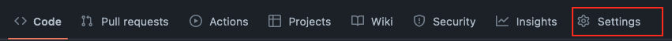

1. On the `Settings` page, click on the `Pages` in the navigation menu on the left-hand side.
   
   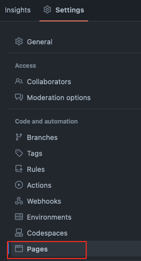

1. In the `Branch` section, select the `main` branch from the drop-down list and click the `Save` button.
   
   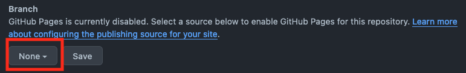
   
   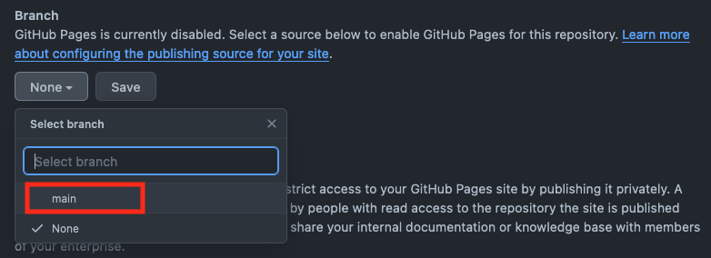
   
   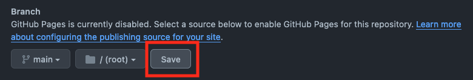

1. Open your watsonx assistant editor and get the code snippet by following
   [this instructions](https://ibm.github.io/watsonx-chatbot-lab/lab-3/#2-deploy-your-assistant-on-a-live-channel-across-a-broader-set-of-customers)

1. Go back to the repository you forked and show the file list view by clicking the `Code` in the menu bar.
   
   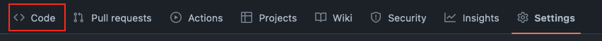

1. Click on the gear icon in the `About` section
   
   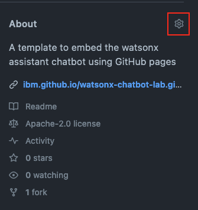

1. In the `Website` section, check the `Use your GitHub Pages website` checkbox and click `Save Changes` button
   to save the change.
   
   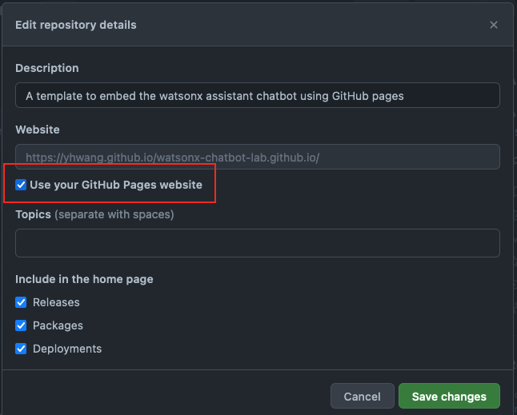

   Now you GitHub Pages URL will show up in the `Action` section.

1. Click the `index.html` file, and you will see the HTML content of the sample file.
   
   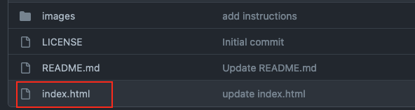

1. Directly edit the file by clicking the `Pencil` icon on the upper-right corner of the HTML content.
   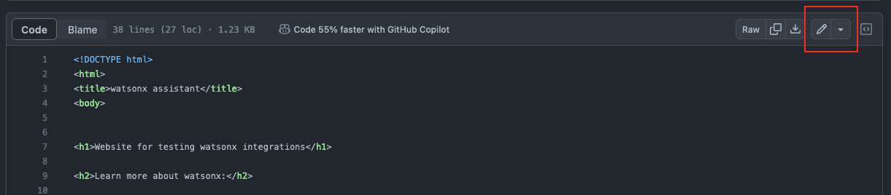

1. You should see a comment saying:
   ```<!-- Replace the code below with the web chat code snippet from your watsonx assistant -->```
   Replace the code below that comment with your web chat code snippet and click the `Commit changes...`
   button on the upper-right corner. In the pop-up widget, edit the commit message you see fit and
   click the `Commit changes` button to save the change.

1. Click the `Actions` on the top menu bar, you should see a workflow named `page build and deployment`
   is running or finished. Click it to show the workflow details.
   
   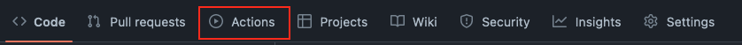

1. Click on the URL link on the `deploy` node. It will redirect you to the index.html page with the
   embedded web chat!
   
   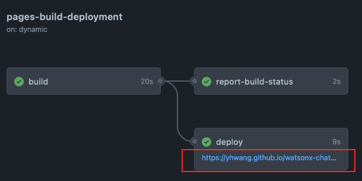
